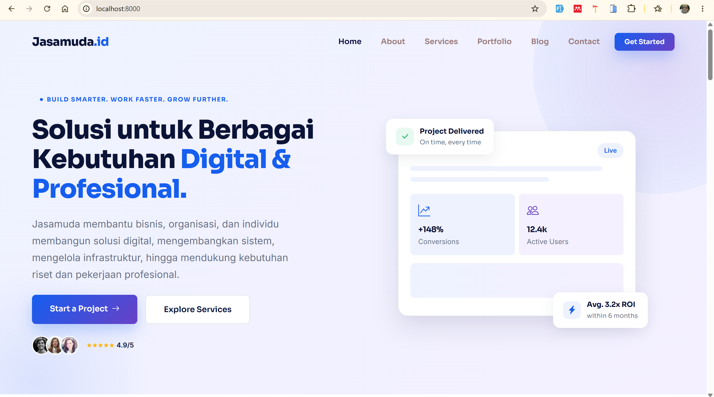
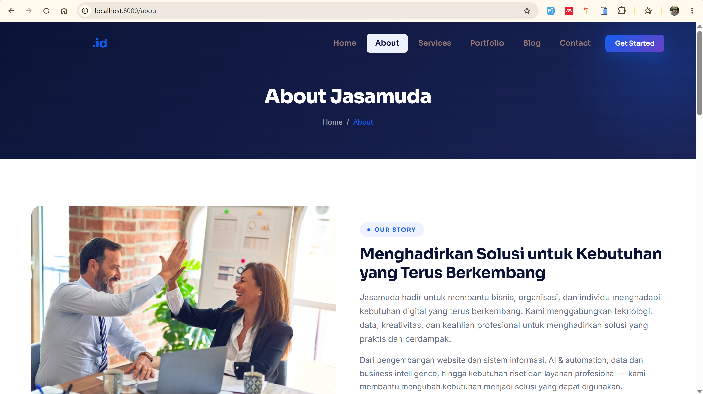
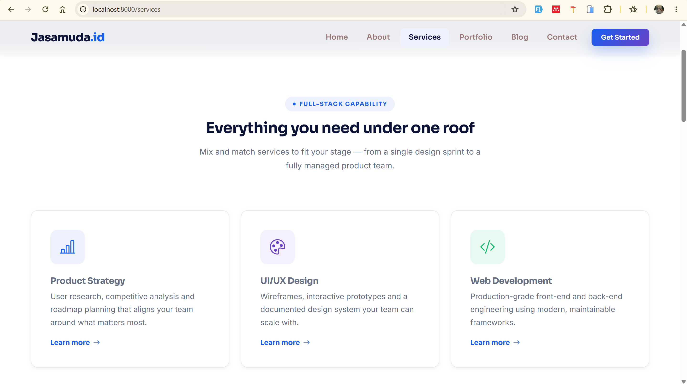
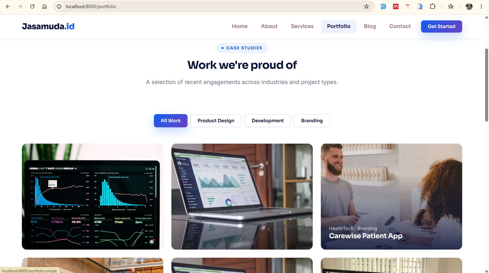

<div align="center">

# Jasamuda.id — Company Profile Website

**Build Smarter. Work Faster. Grow Further.**

Website company profile untuk **Jasamuda**, penyedia solusi digital, teknologi, data, dan layanan profesional untuk bisnis, organisasi, dan individu.


</div>

---

## Daftar Isi

- [Tentang Proyek](#tentang-proyek)
- [Status Pengembangan](#status-pengembangan)
- [Tampilan Website (Screenshot)](#tampilan-website-screenshot)
- [Fitur Frontend](#fitur-frontend)
- [Halaman dan Routing](#halaman-dan-routing)
- [Tech Stack](#tech-stack)
- [Struktur Folder](#struktur-folder)
- [Prasyarat](#prasyarat)
- [Instalasi dengan Docker (Direkomendasikan)](#instalasi-dengan-docker-direkomendasikan)
- [Instalasi Manual (Tanpa Docker)](#instalasi-manual-tanpa-docker)
- [Konfigurasi Environment](#konfigurasi-environment)
- [Perintah yang Sering Dipakai](#perintah-yang-sering-dipakai)
- [Arsitektur View Blade](#arsitektur-view-blade)
- [Panduan Desain dan Kustomisasi](#panduan-desain-dan-kustomisasi)
- [Cara Menambah Halaman Baru](#cara-menambah-halaman-baru)
- [Catatan dan Batasan Saat Ini](#catatan-dan-batasan-saat-ini)
- [Roadmap Pengembangan](#roadmap-pengembangan)
- [Panduan Kontribusi](#panduan-kontribusi)
- [Kredit dan Lisensi](#kredit-dan-lisensi)
- [Kontak](#kontak)

---

## Tentang Proyek

**Jasamuda.id** adalah website *company profile* yang memperkenalkan Jasamuda beserta layanannya. Jasamuda membantu bisnis & UMKM, perusahaan, organisasi, akademisi, dan profesional dalam:

- Pengembangan website dan sistem informasi
- AI & automation
- Data dan business intelligence
- Pengelolaan infrastruktur
- Dukungan riset dan layanan profesional

Repository ini berisi aplikasi **Laravel** yang saat ini berfokus pada **tampilan frontend** (halaman publik). Desain dibangun di atas template **Nexora** (Bootstrap 5) yang kemudian diintegrasikan ke dalam Blade layout Laravel, lengkap dengan environment **Docker** (PHP-FPM, Nginx, MySQL) untuk pengembangan lokal.

---

## Status Pengembangan

> **Fase saat ini: Frontend (tahap awal).**

| Komponen | Status |
| --- | --- |
| Tampilan halaman publik (Home, About, Services, Portfolio, Blog, Contact) | Selesai (masih perlu penyesuaian konten) |
| Layout Blade, navbar, dan footer reusable | Selesai |
| Environment Docker (PHP 8.3, Nginx, MySQL 8) | Selesai |
| Database dan model konten (layanan, portofolio, blog, pesan masuk) | Belum ada |
| Panel admin / CMS | Belum ada |
| Form kontak dan newsletter yang tersambung ke backend | Belum ada |
| Autentikasi admin | Belum ada |
| Multi-bahasa, SEO meta dinamis, sitemap | Belum ada |

Saat ini seluruh halaman masih **statis** (dirender langsung dari route menggunakan closure) dan belum mengambil data dari database. Rencana lengkap ada di bagian [Roadmap Pengembangan](#roadmap-pengembangan).

---

## Tampilan Website (Screenshot)

> Simpan semua gambar di folder `docs/screenshots/` dengan nama file seperti pada tabel di bawah, maka gambar akan tampil otomatis di README ini. Panduan cara mengambil screenshot ada di bagian [Cara Mengambil Screenshot](#cara-mengambil-screenshot).

### Halaman Beranda (Home)



*Hero section, ringkasan layanan, alasan memilih Jasamuda, alur kerja (Discover → Plan → Build → Deliver & Improve), pilihan portofolio, dan testimoni klien.*

### Halaman About



*Cerita perusahaan, prinsip kerja, dan tim Jasamuda.*

<!-- ### Halaman Services



*Daftar layanan, model kerja sama, dan FAQ.*

### Halaman Detail Layanan


*Ringkasan layanan, cakupan pekerjaan, proses kerja, dan pertanyaan umum.*

### Halaman Portfolio



*Galeri proyek dengan filter kategori (All Work, Product Design, Development, Branding).*

### Halaman Detail Portfolio


*Studi kasus: tantangan, pendekatan, hasil, dan teknologi yang digunakan.*

### Halaman Blog


*Daftar artikel, pencarian, dan kategori.*

### Halaman Detail Blog


*Isi artikel, profil penulis, form komentar, dan artikel terkait.*

### Halaman Contact


*Informasi alamat, email, telepon, dan form pesan.*

### Tampilan Mobile (Responsive)

<p align="center">
  
  &nbsp;&nbsp;
  
  &nbsp;&nbsp;
  
</p>

### Daftar File Screenshot yang Dibutuhkan

| Halaman | Nama file | URL lokal |
| --- | --- | --- |
| Home | `docs/screenshots/home.png` | `http://localhost:8000/` |
| About | `docs/screenshots/about.png` | `http://localhost:8000/about` |
| Services | `docs/screenshots/services.png` | `http://localhost:8000/services` |
| Service Details | `docs/screenshots/service-details.png` | `http://localhost:8000/services/details` |
| Portfolio | `docs/screenshots/portfolio.png` | `http://localhost:8000/portfolio` |
| Portfolio Single | `docs/screenshots/portfolio-single.png` | `http://localhost:8000/portfolio/single` |
| Blog | `docs/screenshots/blog.png` | `http://localhost:8000/blog` |
| Blog Details | `docs/screenshots/blog-details.png` | `http://localhost:8000/blog/details` |
| Contact | `docs/screenshots/contact.png` | `http://localhost:8000/contact` |
| Mobile Home | `docs/screenshots/mobile-home.png` | `http://localhost:8000/` (mode mobile) |
| Mobile Menu | `docs/screenshots/mobile-menu.png` | menu hamburger terbuka (mode mobile) |
| Mobile Contact | `docs/screenshots/mobile-contact.png` | `http://localhost:8000/contact` (mode mobile) |

### Cara Mengambil Screenshot

1. Jalankan website (lihat [Instalasi](#instalasi-dengan-docker-direkomendasikan)) dan buka di Google Chrome.
2. Tekan `F12` untuk membuka DevTools, lalu tekan `Ctrl + Shift + P` (Mac: `Cmd + Shift + P`).
3. Ketik **"Capture full size screenshot"** lalu tekan Enter. Chrome akan menyimpan tangkapan satu halaman penuh.
4. Untuk tampilan mobile, aktifkan *Toggle device toolbar* (`Ctrl + Shift + M`), pilih perangkat (misalnya iPhone 14 Pro), lalu ulangi langkah 2–3.
5. Ganti nama file sesuai tabel di atas dan simpan ke `docs/screenshots/`.
6. Disarankan mengompres gambar (misalnya lewat [squoosh.app](https://squoosh.app)) supaya repository tetap ringan.

Setelah semua file ditambahkan, commit dan push:

```bash
git add docs/screenshots README.md
git commit -m "docs: tambah screenshot dan README"
git push origin main
``` -->

---

## Fitur Frontend

### Umum

- **Layout reusable** dengan Blade (`layouts/app.blade.php`) beserta partial `navbar` dan `footer`.
- **Navbar fixed** dengan efek berubah saat halaman di-scroll dan menu aktif otomatis sesuai halaman (`request()->routeIs()`).
- **Menu hamburger animasi** untuk mobile, otomatis menutup saat link diklik.
- **Smooth scroll** untuk anchor link di dalam halaman.
- **Scroll reveal** (animasi muncul saat elemen terlihat) berbasis `IntersectionObserver`, dengan fallback untuk browser lama.
- **Tombol Back to Top** yang muncul setelah scroll melewati 400px.
- **Validasi form sisi klien** menggunakan class `needs-validation` milik Bootstrap.
- **Desain responsif** untuk desktop, tablet, dan mobile.
- **Favicon SVG inline** (huruf "J" berlatar biru), tanpa file gambar tambahan.

### Per Halaman

| Halaman | Isi utama |
| --- | --- |
| **Home** | Hero, badge klien dan rating, bidang solusi (Bisnis & UMKM, Perusahaan, Organisasi, Akademik, Profesional), ringkasan layanan, alasan memilih Jasamuda beserta statistik, alur kerja 4 tahap, pilihan portofolio, testimoni |
| **About** | Cerita perusahaan, prinsip kerja (Purpose First, Simple & Effective, Quality Matters, Always Evolving), tim (Technology & Development, Data & AI, Research & Professional, Design & Creative), ajakan kontak |
| **Services** | 6 kartu layanan, model kerja sama (fixed-scope, retainer, staff augmentation), FAQ accordion |
| **Service Details** | Ikhtisar layanan, cakupan pekerjaan, proses 4 langkah, FAQ, sidebar semua layanan, ajakan konsultasi |
| **Portfolio** | Grid proyek dengan **filter kategori** (JavaScript vanilla) |
| **Portfolio Single** | Studi kasus lengkap: info klien, tantangan, pendekatan, hasil, kutipan klien, metrik, tech stack, navigasi proyek sebelumnya/berikutnya |
| **Blog** | Daftar artikel unggulan dan reguler, pagination, pencarian, kategori |
| **Blog Details** | Artikel, tag, kotak penulis, form komentar, artikel terkait, kategori |
| **Contact** | Alamat kantor, email, telepon, jam operasional, form pesan dengan pilihan layanan dan persetujuan privasi |
| **Pricing** | Halaman sudah dibuat namun **dinonaktifkan** (di-comment) dan menu navigasinya disembunyikan |

---

## Halaman dan Routing

Semua route berada di `src/routes/web.php` dan saat ini mengembalikan view statis.

| Method | URI | Nama route | View |
| --- | --- | --- | --- |
| GET | `/` | `home` | `pages.home` |
| GET | `/about` | `about` | `pages.about` |
| GET | `/services` | `services` | `pages.services` |
| GET | `/services/details` | `service.details` | `pages.service-details` |
| GET | `/portfolio` | `portfolio` | `pages.portfolio` |
| GET | `/portfolio/single` | `portfolio.single` | `pages.portfolio-single` |
| GET | `/blog` | `blog` | `pages.blog` |
| GET | `/blog/details` | `blog.details` | `pages.blog-details` |
| GET | `/pricing` | `pricing` | `pages.pricing` (dinonaktifkan) |
| GET | `/contact` | `contact` | `pages.contact` |

Untuk melihat daftar route langsung dari Laravel:

```bash
docker compose exec app php artisan route:list
```

---

## Tech Stack

### Backend dan Infrastruktur

| Teknologi | Versi | Keterangan |
| --- | --- | --- |
| PHP | 8.3 (`php:8.3-fpm`) | Runtime aplikasi |
| Laravel | ^13.17 | Framework utama |
| MySQL | 8.0 | Database (via Docker) |
| Nginx | alpine | Web server / reverse proxy ke PHP-FPM |
| Docker & Docker Compose | — | Environment pengembangan |
| Composer | latest (di image) | Manajemen dependency PHP |

### Frontend

| Teknologi | Versi | Sumber |
| --- | --- | --- |
| Bootstrap | 5.3.3 | CDN (jsDelivr) |
| Bootstrap Icons | 1.11.3 | CDN (jsDelivr) |
| Google Fonts | Inter (400–700) dan Sora (400–800) | CDN |
| CSS kustom | — | `src/public/css/custom.css` |
| JavaScript kustom (vanilla) | — | `src/public/js/main.js` |

### Tooling Bawaan Laravel

| Paket | Fungsi |
| --- | --- |
| `laravel/tinker` | REPL untuk debugging |
| `laravel/pint` | Code style formatter |
| `laravel/pail` | Melihat log secara real-time |
| `phpunit/phpunit` ^12.5 | Testing |
| `fakerphp/faker` | Data dummy |
| Vite ^8, Tailwind CSS ^4, `laravel-vite-plugin` | Sudah terpasang di `package.json` namun **belum dipakai** oleh layout saat ini (layout memakai Bootstrap CDN dan `public/css/custom.css`) |

---

## Struktur Folder

```text
jasamuda-company-profile/
├── docker/
│   ├── nginx/
│   │   └── default.conf          # Konfigurasi Nginx (root ke /public, fastcgi ke app:9000)
│   └── php/
│       ├── Dockerfile            # Image PHP 8.3-FPM + ekstensi + Composer + Node
│       └── php.ini               # Limit upload 50MB, memory 256MB, timeout 300s
├── jasamuda-tamplate/            # Template HTML mentah (Nexora) sebagai referensi desain
│   ├── *.html                    # index, about, services, portfolio, blog, contact, dll
│   ├── css/custom.css
│   └── js/main.js
├── src/                          # Aplikasi Laravel
│   ├── app/
│   │   ├── Http/Controllers/     # (baru Controller dasar)
│   │   ├── Models/               # (baru User)
│   │   └── Providers/
│   ├── bootstrap/
│   ├── config/
│   ├── database/
│   │   ├── factories/
│   │   ├── migrations/           # users, cache, jobs (bawaan Laravel)
│   │   └── seeders/
│   ├── public/
│   │   ├── css/custom.css        # Stylesheet utama website
│   │   ├── js/main.js            # Interaksi UI (navbar, reveal, back-to-top)
│   │   └── index.php
│   ├── resources/
│   │   ├── css/app.css           # Entry Vite (belum dipakai layout)
│   │   ├── js/app.js             # Entry Vite (belum dipakai layout)
│   │   └── views/
│   │       ├── layouts/app.blade.php
│   │       ├── partials/
│   │       │   ├── navbar.blade.php
│   │       │   └── footer.blade.php
│   │       └── pages/
│   │           ├── home.blade.php
│   │           ├── about.blade.php
│   │           ├── services.blade.php
│   │           ├── service-details.blade.php
│   │           ├── portfolio.blade.php
│   │           ├── portfolio-single.blade.php
│   │           ├── blog.blade.php
│   │           ├── blog-details.blade.php
│   │           ├── pricing.blade.php   # dinonaktifkan
│   │           └── contact.blade.php
│   ├── routes/
│   │   └── web.php               # Definisi route halaman publik
│   ├── tests/
│   ├── .env.example
│   ├── composer.json
│   └── package.json
├── docker-compose.yml            # Orkestrasi service: app, webserver, db
└── README.md
```

---

## Prasyarat

**Untuk jalur Docker (direkomendasikan):**

- [Docker](https://docs.docker.com/get-docker/) dan Docker Compose v2
- [Git](https://git-scm.com/)

**Untuk jalur manual (tanpa Docker):**

- PHP 8.3 atau lebih baru, dengan ekstensi: `pdo_mysql`, `mbstring`, `exif`, `pcntl`, `bcmath`, `gd`, `zip`, `xml`
- Composer 2
- MySQL 8.0 (atau SQLite untuk uji coba cepat)
- Git

> Node.js dan npm **tidak wajib** untuk menjalankan tampilan saat ini, karena layout memakai CSS/JS dari CDN dan folder `public/`.

---

## Instalasi dengan Docker (Direkomendasikan)

### 1. Clone repository

```bash
git clone https://github.com/dfulndri/jasamuda-company-profile.git
cd jasamuda-company-profile
```

### 2. Siapkan file environment

```bash
cp src/.env.example src/.env
```

Buka `src/.env`, lalu sesuaikan bagian database agar cocok dengan `docker-compose.yml`:

```env
APP_NAME=Jasamuda
APP_URL=http://localhost:8000

DB_CONNECTION=mysql
DB_HOST=db
DB_PORT=3306
DB_DATABASE=jasamuda_db
DB_USERNAME=jasamuda_user
DB_PASSWORD=jasamuda_pass
```

> `DB_HOST` harus `db` (nama service di Docker Compose), bukan `127.0.0.1`.

### 3. Build dan jalankan container

```bash
docker compose up -d --build
```

Tiga container akan berjalan: `jasamuda_app` (PHP-FPM), `jasamuda_nginx` (web server), dan `jasamuda_db` (MySQL).

### 4. Install dependency PHP

```bash
docker compose exec app composer install
```

### 5. Generate application key

```bash
docker compose exec app php artisan key:generate
```

### 6. Jalankan migrasi database

```bash
docker compose exec app php artisan migrate
```

> Migrasi wajib dijalankan karena `SESSION_DRIVER`, `CACHE_STORE`, dan `QUEUE_CONNECTION` default-nya memakai `database`. Tanpa tabel tersebut, halaman bisa error.

### 7. Atur permission folder (jika muncul error permission)

```bash
docker compose exec app chown -R www-data:www-data storage bootstrap/cache
docker compose exec app chmod -R 775 storage bootstrap/cache
```

### 8. Buka website

| Layanan | Alamat |
| --- | --- |
| Website | http://localhost:8000 |
| MySQL (dari host, misal DBeaver/Navicat/TablePlus) | `127.0.0.1:3306` |

Kredensial MySQL untuk pengembangan lokal (sesuai `docker-compose.yml`):

| Item | Nilai |
| --- | --- |
| Database | `jasamuda_db` |
| User | `jasamuda_user` |
| Password | `jasamuda_pass` |
| Root password | `root123` |

> **Penting:** kredensial di atas hanya untuk pengembangan lokal. Ganti semuanya sebelum deploy ke server publik dan jangan membuka port 3306 ke internet.

### Menghentikan environment

```bash
docker compose down            # hentikan container (data database tetap tersimpan di volume)
docker compose down -v         # hentikan dan HAPUS volume database
```

---

## Instalasi Manual (Tanpa Docker)

```bash
# 1. Clone dan masuk ke folder aplikasi
git clone https://github.com/dfulndri/jasamuda-company-profile.git
cd jasamuda-company-profile/src

# 2. Install dependency
composer install

# 3. Siapkan environment
cp .env.example .env
php artisan key:generate
```

**Opsi A — SQLite (paling cepat untuk uji coba):**

```bash
touch database/database.sqlite
php artisan migrate
```

Pastikan `.env` berisi `DB_CONNECTION=sqlite`.

**Opsi B — MySQL lokal:**

Buat database kosong, lalu ubah `.env`:

```env
DB_CONNECTION=mysql
DB_HOST=127.0.0.1
DB_PORT=3306
DB_DATABASE=jasamuda_db
DB_USERNAME=root
DB_PASSWORD=
```

```bash
php artisan migrate
```

**Jalankan server pengembangan:**

```bash
php artisan serve
```

Buka http://127.0.0.1:8000.

> Alternatif satu perintah: `composer run setup` (menjalankan install, copy `.env`, generate key, migrate, `npm install`, dan `npm run build`).

---

## Konfigurasi Environment

Variabel penting pada `src/.env`:

| Variabel | Default (`.env.example`) | Keterangan |
| --- | --- | --- |
| `APP_NAME` | `Laravel` | Ganti menjadi `Jasamuda` |
| `APP_ENV` | `local` | Ubah ke `production` saat deploy |
| `APP_DEBUG` | `true` | **Wajib `false`** di production |
| `APP_URL` | `http://localhost:8000` | Sesuaikan dengan domain |
| `APP_LOCALE` | `en` | Bisa diubah ke `id` bila konten dilokalkan |
| `DB_CONNECTION` | `sqlite` | Ubah ke `mysql` untuk Docker |
| `DB_HOST` | (di-comment) | `db` untuk Docker, `127.0.0.1` untuk lokal |
| `SESSION_DRIVER` | `database` | Membutuhkan tabel `sessions` (sudah ada di migrasi) |
| `CACHE_STORE` | `database` | Membutuhkan tabel `cache` |
| `QUEUE_CONNECTION` | `database` | Membutuhkan tabel `jobs` |
| `MAIL_MAILER` | `log` | Email hanya ditulis ke log; ubah ke SMTP saat form kontak aktif |
| `MAIL_FROM_ADDRESS` | `hello@example.com` | Ganti dengan email resmi |

---

## Perintah yang Sering Dipakai

```bash
# Container
docker compose up -d                          # jalankan
docker compose down                           # hentikan
docker compose logs -f webserver              # log Nginx
docker compose logs -f app                    # log PHP-FPM
docker compose exec app bash                  # masuk ke shell container app

# Laravel (di dalam container)
docker compose exec app php artisan route:list
docker compose exec app php artisan migrate
docker compose exec app php artisan migrate:fresh --seed
docker compose exec app php artisan optimize:clear
docker compose exec app php artisan tinker

# Kualitas kode
docker compose exec app ./vendor/bin/pint     # rapikan code style
docker compose exec app php artisan test      # jalankan test
```

---

## Arsitektur View Blade

Setiap halaman memakai satu layout utama sehingga navbar, footer, CSS, dan JS cukup dikelola di satu tempat.

```text
layouts/app.blade.php
 ├── @include('partials.navbar')
 ├── @yield('content')      ← isi tiap halaman
 ├── @include('partials.footer')
 └── @yield('scripts')      ← JavaScript khusus halaman (contoh: filter portofolio)
```

Section yang tersedia di layout:

| Section | Fungsi |
| --- | --- |
| `@yield('title')` | Judul tab browser, format akhir: `{Judul} — Jasamuda` |
| `@yield('meta')` | Tambahan tag `<meta>` per halaman |
| `@yield('styles')` | Tambahan CSS per halaman |
| `@yield('content')` | Isi utama halaman |
| `@yield('scripts')` | Tambahan JS per halaman |

Contoh kerangka halaman:

```blade
@extends('layouts.app')

@section('title', 'Nama Halaman')

@section('content')
  {{-- isi halaman di sini --}}
@endsection
```

---

## Panduan Desain dan Kustomisasi

Seluruh warna, font, spasi, radius, dan bayangan dikelola lewat **CSS variables** di bagian atas `src/public/css/custom.css`, sehingga identitas visual bisa diubah dari satu tempat.

### Palet Warna

| Variabel | Nilai | Kegunaan |
| --- | --- | --- |
| `--n-primary` | `#155EEF` | Warna utama (tombol, link) |
| `--n-primary-dark` | `#0E3FB0` | Hover / varian gelap |
| `--n-secondary` | `#6941C6` | Aksen ungu |
| `--n-navy` | `#0B1437` | Teks judul dan footer |
| `--n-success` | `#12B76A` | Indikator sukses |
| `--n-slate` / `--n-slate-light` | `#667085` / `#98A2B3` | Teks sekunder |
| `--n-bg` / `--n-bg-alt` | `#F7F9FC` / `#EEF2FF` | Latar halaman |
| `--n-border` | `#E4E7EC` | Garis pembatas |

### Tipografi

| Peran | Font |
| --- | --- |
| Judul (display) | **Sora** |
| Isi (body) | **Inter** |

### Token Lainnya

- **Gradient:** `--n-gradient-primary`, `--n-gradient-soft`, `--n-gradient-dark`
- **Radius:** `--n-radius-sm` (8px), `--n-radius-md` (14px), `--n-radius-lg` (20px), `--n-radius-pill`
- **Shadow:** `--n-shadow-sm`, `--n-shadow-md`, `--n-shadow-lg`, `--n-shadow-primary`
- **Spacing:** `--n-space-xs` sampai `--n-space-2xl`

### Mengganti Logo dan Nama Brand

- Teks logo ada di `resources/views/partials/navbar.blade.php` dan `resources/views/partials/footer.blade.php` (`Jasamuda<span>.id</span>`).
- Favicon didefinisikan inline di `resources/views/layouts/app.blade.php`. Ganti dengan `<link rel="icon" href="{{ asset('favicon.ico') }}">` jika ingin memakai file sendiri.

### Mengganti Info Kontak

Edit `resources/views/pages/contact.blade.php` (alamat, email, telepon, jam operasional) dan tautan sosial media di `resources/views/partials/footer.blade.php`.

---

## Cara Menambah Halaman Baru

1. Buat view baru, misalnya `src/resources/views/pages/team.blade.php`:

   ```blade
   @extends('layouts.app')

   @section('title', 'Team')

   @section('content')
     <section class="py-5">
       <div class="container">
         <h1>Team</h1>
       </div>
     </section>
   @endsection
   ```

2. Daftarkan route di `src/routes/web.php`:

   ```php
   Route::get('/team', function () {
       return view('pages.team');
   })->name('team');
   ```

3. Tambahkan menu di `resources/views/partials/navbar.blade.php`:

   ```blade
   <li class="nav-item">
     <a class="nav-link nav2 {{ request()->routeIs('team') ? 'active' : '' }}"
        href="{{ route('team') }}">Team</a>
   </li>
   ```

---

## Catatan dan Batasan Saat Ini

Daftar ini dibuat agar developer berikutnya tahu kondisi sebenarnya dari kode:

- **Belum ada backend.** Semua halaman statis dan belum memakai controller, model, maupun query database. Hanya tabel bawaan Laravel (`users`, `cache`, `jobs`, sessions) yang tersedia.
- **Form kontak dan newsletter belum berfungsi.** Keduanya hanya memiliki validasi tampilan di sisi klien dan belum memiliki `action`, route `POST`, penyimpanan data, maupun pengiriman email.
- **Halaman Pricing dinonaktifkan.** Seluruh isi `pages/pricing.blade.php` sedang di-comment dan link menunya disembunyikan di navbar, tetapi route `/pricing` masih terdaftar sehingga akan menampilkan halaman kosong.
- **Tautan email di halaman Contact perlu diperbaiki.** Atribut `href` masih `jasamuda@gmail.com` tanpa awalan `mailto:`.
- **Sebagian konten masih bawaan template Nexora.** Halaman Services, Service Details, Portfolio, Blog, dan Pricing masih berisi teks/data contoh (dominan bahasa Inggris, nama proyek dan penulis fiktif, harga dalam USD). Home, About, dan Contact sudah memakai konten Jasamuda dalam bahasa Indonesia.
- **Gambar masih remote.** Foto memakai Unsplash dan avatar memakai `i.pravatar.cc`, sehingga membutuhkan koneksi internet dan sebaiknya diganti dengan aset milik sendiri.
- **Halaman detail belum dinamis.** Rute `/services/details`, `/portfolio/single`, dan `/blog/details` tidak memakai slug atau ID.
- **Tag HTML masih `lang="en"`** dan belum ada meta description, Open Graph, maupun sitemap.
- **Vite dan Tailwind belum terpakai.** Layout memakai Bootstrap CDN + `public/css/custom.css`, sehingga `npm install` tidak diperlukan untuk saat ini.
- **Ekstensi Redis terpasang di image PHP**, tetapi belum ada service Redis di `docker-compose.yml`.
- **Kredensial database di `docker-compose.yml` bersifat sementara** dan hanya layak untuk lokal.
- Nama folder template tertulis `jasamuda-tamplate` (typo dari *template*). Folder ini hanya referensi dan tidak dipakai saat aplikasi berjalan.

---

## Roadmap Pengembangan

### Fase 1 — Frontend (sedang berjalan)

- [x] Integrasi template ke Blade layout Laravel
- [x] Navbar, footer, dan komponen UI reusable
- [x] Environment Docker (PHP-FPM, Nginx, MySQL)
- [x] Halaman Home, About, Services, Portfolio, Blog, Contact
- [ ] Ganti seluruh konten placeholder dengan konten Jasamuda (bahasa Indonesia)
- [ ] Ganti gambar Unsplash/pravatar dengan aset sendiri
- [ ] Perbaiki `mailto:`, halaman Pricing, dan tautan sosial media
- [ ] Tambah meta SEO dan Open Graph
- [ ] Tambah screenshot ke dokumentasi

### Fase 2 — Database dan Backend

- [ ] Rancang skema database (layanan, kategori, portofolio, artikel blog, tag, pesan kontak, pengaturan situs, subscriber newsletter)
- [ ] Migration, model, factory, dan seeder
- [ ] Controller dan route dinamis (slug untuk detail layanan, portofolio, dan blog)
- [ ] Form kontak tersimpan ke database dan terkirim ke email
- [ ] Form newsletter tersimpan ke database
- [ ] Validasi server-side, proteksi spam (honeypot / rate limiting)

### Fase 3 — Panel Admin (CMS)

- [ ] Autentikasi admin dan manajemen peran
- [ ] CRUD layanan, portofolio, blog, kategori, dan tag
- [ ] Upload dan manajemen gambar/media
- [ ] Inbox pesan dari form kontak
- [ ] Pengaturan situs (profil perusahaan, kontak, sosial media, SEO)
- [ ] Dashboard ringkasan

### Fase 4 — Penyempurnaan dan Deployment

- [ ] Optimasi performa (caching, lazy loading gambar, minify aset)
- [ ] SEO lanjutan (sitemap.xml, robots.txt, structured data)
- [ ] Opsi multi-bahasa (ID/EN)
- [ ] Pengujian otomatis (feature test halaman dan form)
- [ ] CI/CD dan panduan deploy ke server produksi (HTTPS, `APP_DEBUG=false`, kredensial baru)

---

## Panduan Kontribusi

1. Fork repository ini.
2. Buat branch fitur: `git checkout -b feat/nama-fitur`
3. Rapikan kode sebelum commit: `docker compose exec app ./vendor/bin/pint`
4. Commit dengan pesan yang jelas, misalnya:
   - `feat: tambah halaman team`
   - `fix: perbaiki link email di halaman contact`
   - `docs: perbarui screenshot`
5. Push ke branch dan buka Pull Request.

---

## Kredit dan Lisensi

- **Template desain:** [Nexora — Free Bootstrap 5 & HTML SaaS Business Website Template](https://themewagon.com/themes/nexora/) oleh Harshad Mahadik, didistribusikan oleh [ThemeWagon](https://themewagon.com) dengan lisensi **MIT**. Salinan template asli tersimpan di folder `jasamuda-tamplate/`.
- **Framework:** [Laravel](https://laravel.com) (lisensi MIT).
- **UI library:** [Bootstrap](https://getbootstrap.com) dan [Bootstrap Icons](https://icons.getbootstrap.com) (lisensi MIT).
- **Font:** Inter dan Sora melalui Google Fonts (SIL Open Font License).
- **Foto placeholder:** [Unsplash](https://unsplash.com) dan [Pravatar](https://pravatar.cc), hanya untuk keperluan pengembangan dan sebaiknya diganti pada versi produksi.

Konten, nama, logo, dan identitas **Jasamuda** merupakan milik pemilik proyek. Lisensi khusus untuk kode proyek ini belum ditentukan; tambahkan file `LICENSE` bila repository akan dibuka untuk umum.

---

## Kontak

**Jasamuda.id**

- Alamat: Graha Catania, Jl. Graha Catania Raya No.20 Blok U1, Ciakar, Kec. Panongan, Kabupaten Tangerang, Banten 15710
- Email: jasamuda@gmail.com
- Telepon / WhatsApp: +62 851-1132-8168
- Jam operasional: Senin – Minggu, 08.00 – 18.00 WIB
- Repository: [github.com/dfulndri/jasamuda-company-profile](https://github.com/dfulndri/jasamuda-company-profile)

---

<div align="center">

&copy; 2026 Jasamuda.id — All rights reserved.

</div>